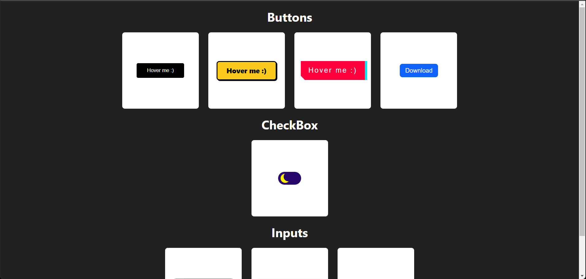

<h1 align="center">Bem Vindo ao Components Showcase 👋</h1>
<p align="center">⚛️💅 Este projeto consiste na conversão de projetos de HTML e CSS puro encontrados publicamente ou desenvolvido por mim em componentes React, utilizando o pacote "styled-components". O objetivo é aproveitar a flexibilidade e reutilização de componentes oferecidos pelo React, enquanto mantém a aparência e estilo definidos nos projetos originais. Além disso, a utilização de "styled-components" permite uma maior facilidade na personalização e manutenção dos estilos dos componentes.</p>

<div align="center">



</div>

<p align="center">
  
  <a href="#" target="_blank">
    
  </a>
  <a href="http://teste.netlify.app/doc" target="_blank">
    
  </a>
  <a href="https://twitter.com/Wesley_AllanS" target="_blank">
    
  </a>
</p>

## 📨 Instalação

```sh
git clone https://github.com/wesleyallan/components-showcase.git
cd components-showcase
yarn
```

## 🚀 Executar

```sh
yarn dev
```

## 😎 Utilizar

Para visualizar os components basta acessar o link gerado pelo script na hora da execução, padrão normalmente é 5173

```sh
https://localhost:5173
```

## Author

👤 **Wesley Silva**

- Website: https://wesleyallan.github.io/mypage
- Twitter: [@Wesley_AllanS](https://twitter.com/Wesley_AllanS)
- Github: [@wesleyallan](https://github.com/wesleyallan)
- LinkedIn: [@wesleyallan](https://linkedin.com/in/wesleyallan)

## Mostre seu apoio

Dê um ⭐️ se esse projeto te ajudou!
